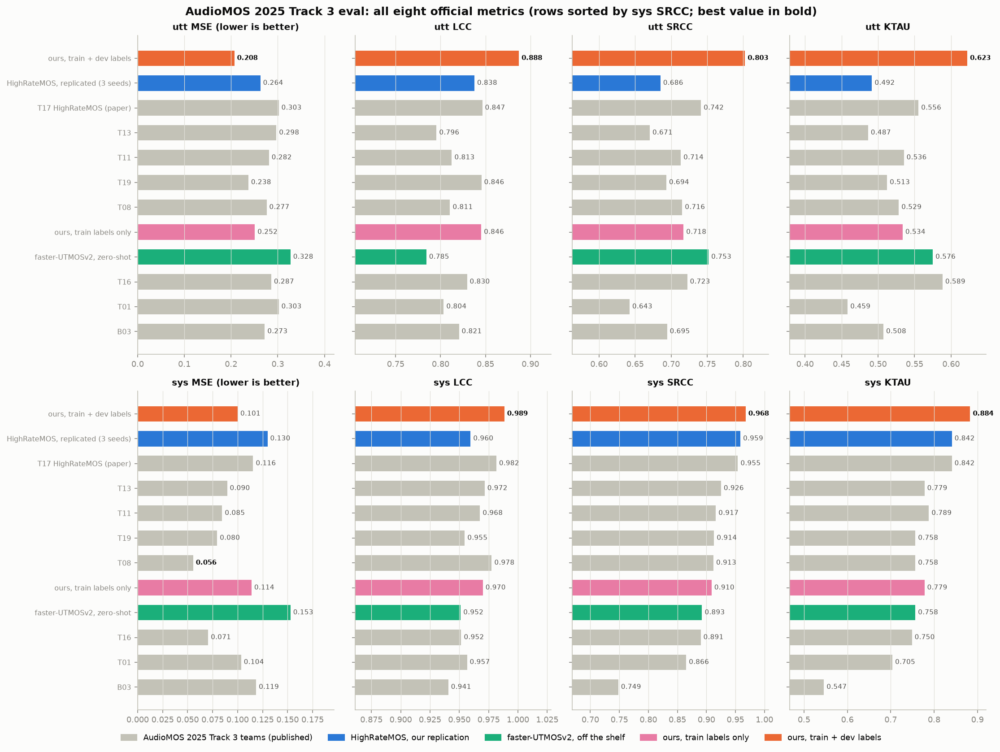
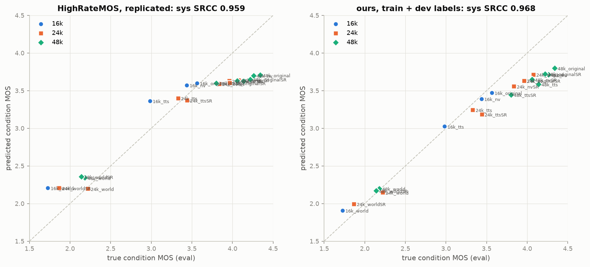
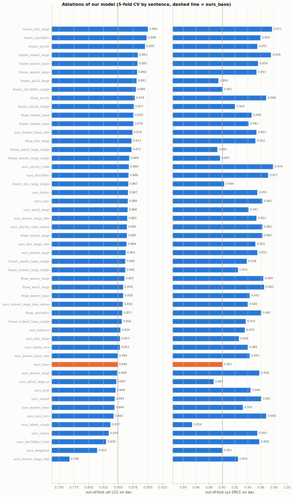

# SOTA-MOS

MOS prediction for speech at 16, 24 and 48 kHz: [AudioMOS Challenge 2025](https://sites.google.com/view/voicemos-challenge/past-challenges/audiomos-challenge-2025) Track 3.

**SOTA-MOS beats every Track 3 system, including the winner HighRateMOS, on 7 of 8 official metrics.**
It is three frozen self-supervised speech models with small trained heads on their early layers and on the clip's native-rate spectrum.

**Model:** [Scicom-intl/HighRateMOS-VoiceMOS2025](https://huggingface.co/Scicom-intl/HighRateMOS-VoiceMOS2025), folder `model/` (41 MB of heads; the backbones load from the Hub).

| eval (400 clips, 20 conditions) | utt MSE | utt LCC | utt SRCC | utt KTAU | sys MSE | sys LCC | sys SRCC | sys KTAU |
|---|---:|---:|---:|---:|---:|---:|---:|---:|
| **SOTA-MOS** | **0.208** | **0.888** | **0.803** | **0.623** | 0.101 | **0.989** | **0.968** | **0.884** |
| SOTA-MOS, train labels only | 0.252 | 0.846 | 0.718 | 0.534 | 0.114 | 0.970 | 0.910 | 0.779 |
| HighRateMOS (T17), paper | 0.303 | 0.847 | 0.742 | 0.556 | 0.116 | 0.982 | 0.955 | 0.842 |
| HighRateMOS, our replication (3 seeds) | 0.264 | 0.838 | 0.686 | 0.492 | 0.130 | 0.960 | 0.959 | 0.842 |
| faster-UTMOSv2, off the shelf | 0.328 | 0.785 | 0.753 | 0.576 | 0.153 | 0.952 | 0.893 | 0.758 |
| best published Track 3 system, per metric | 0.238 | 0.847 | 0.742 | 0.589 | **0.056** | 0.982 | 0.955 | 0.842 |



## Use

Install, then download the model:

```bash
git clone https://github.com/Scicom-AI-Enterprise-Organization/SOTA-MOS && cd SOTA-MOS
uv sync --extra serve
hf download Scicom-intl/HighRateMOS-VoiceMOS2025 --include "model/*" --local-dir .
```

Score audio files at any sampling rate:

```bash
uv run python -m sotamos.predict --system model/system.json clip_16k.wav clip_28k.wav clip_44k.wav clip_48k.wav clip_48k_world.wav
```

The same natural sentence at four rates, and a WORLD-vocoded copy at 48 kHz:

```
file,sampling_rate,mos
clip_16k.wav,16000,3.7021
clip_28k.wav,24000,3.9625
clip_44k.wav,48000,3.7948
clip_48k.wav,48000,3.8229
clip_48k_world.wav,48000,2.3365
```

From Python:

```python
from sotamos.predict import SystemScorer, load_audio

scorer = SystemScorer("model/system.json", "cuda")
x, sr, x16 = load_audio("clip.wav")   # any rate: resampled to the nearest of 16 / 24 / 48 kHz
print(scorer(x, sr, x16))              # MOS on the mixed-rate listening-test scale (1-5)
```

**Sampling rates.** 16, 24 and 48 kHz are scored as they are. Any other rate goes to the nearest of the three:

| input | scored at |
|---:|---:|
| 8 / 11.025 kHz | 16 kHz |
| 22.05 kHz | 24 kHz |
| 28 / 32 kHz | 24 kHz |
| 44.1 kHz | 48 kHz |
| 88.2 / 96 kHz | 48 kHz |

**Serve** with dynamic batching ([serving/README.md](serving/README.md)):

```bash
cd serving
SYSTEM=../model/system.json MAX_BATCH=16 PP_WORKERS=16 bash run_serve.sh
curl -X POST http://127.0.0.1:8000/predict -F file=@clip_44k.wav
# {"mos": 3.79, "input_sampling_rate": 44100, "sampling_rate": 48000, "duration_s": 5.6, "batch_size": 1, ...}
```

## The task

There are 20 conditions. Each is one generation method at one sampling rate: 4 at 16 kHz, 8 at 24 kHz, 8 at 48 kHz.
The methods are natural speech, WORLD vocoder, a neural vocoder and TTS, plus an AudioSR super-resolved version of each (`*SR`).
Each clip has 10 ratings on a 1–5 scale.

| split | clips | sentences | listening test | listeners |
|---|---|---|---|---|
| train | 400 (120 at 16k, 240 at 24k, 40 at 48k) | 30 | three single-rate tests, one per sampling rate | 01–10 |
| dev | the same 400 clips | 30 | one mixed-rate test | 01–10 |
| eval | 400 new clips | 30 others | the mixed-rate test, second half | 11–20 |

Train labels come from tests where every clip had the same sampling rate. Dev and eval labels come from a test that mixed all three rates.
The primary metric is **system-level SRCC** over the 20 conditions.

## The data

`scripts/analyze_data.py` produces every number and figure in this section.

### The mixed test punishes 16 kHz


**All four 16 kHz conditions fall below the diagonal.** On average they drop 0.35 MOS once listeners also hear 24 and 48 kHz audio.
The 24 kHz conditions move by −0.05 and the 48 kHz ones by −0.04. The same ten listeners rated both tests.

The train labels still rank the dev conditions at sys-SRCC 0.874. A model that perfectly reproduced the train labels would be capped there on dev.

### Eval listeners favour high rates even more


Eval has new sentences and a new panel of listeners. Compared with dev, the 16 kHz conditions are unchanged, 24 kHz gains 0.17 and 48 kHz gains 0.36.
48k_tts moves from 3.36 to 4.14. Each 48 kHz condition averages only 5 clips.

### Knowing each clip's condition gets sys-SRCC 0.904


These reference predictors are given each eval clip's condition and output that condition's MOS from another test:

| reference predictor on eval | utt MSE | utt LCC | utt SRCC | utt KTAU | sys MSE | sys LCC | sys SRCC | sys KTAU |
|---|---:|---:|---:|---:|---:|---:|---:|---:|
| dev condition MOS | 0.201 | 0.894 | 0.819 | 0.666 | 0.100 | 0.980 | 0.904 | 0.811 |
| train condition MOS | 0.222 | 0.856 | 0.702 | 0.520 | 0.101 | 0.945 | 0.748 | 0.575 |

**Condition identity alone beats every Track 3 team on all four utterance-level metrics.**
The train-label reference scores sys-SRCC 0.748, the same as the B03 baseline (0.749).

HighRateMOS reaches sys-SRCC 0.955, above the dev reference. For comparison, two random halves of the eval listeners agree with each other at sys-SRCC 0.95.
Gaps of ±0.02 in sys-SRCC are within listener noise. The utterance-level reliability of eval labels is 0.90 (split-half, Spearman-Brown corrected).

### The sampling rate sets the bandwidth


Every clip fills the band up to its Nyquist frequency. At 24 kHz, the AudioSR versions reach 12 kHz while the plain versions roll off at about 11.5 kHz.
A model that resamples everything to 16 kHz sees the same 0–8 kHz band for 16k_original, 24k_original and 48k_original. Eval rates those three at 3.56, 4.08 and 4.34.

## Rules

- **The model sees audio and the sampling rate only.** The sampling rate comes from the file header.
  Eval filenames name the condition (`16k_sys1_utt31`). They are used only to group clips for system-level metrics.
- **Eval labels are never used for selection.** Checkpoints, configs and ensemble members are chosen on dev labels, or on out-of-fold predictions from 5-fold CV grouped by sentence.
- **Two label settings.** *train-only* uses the train labels, as in the HighRateMOS paper.
  *train+dev* adds the dev labels, which the challenge released at the start of its evaluation phase. Every result states which one it uses.
- **The final system is picked by a fixed rule, written down before any of our systems was scored on eval.**
  Greedy forward selection with replacement (Caruana et al., 2004, at most 10 members) runs over every train+dev candidate:
  fine-tuned CV systems and frozen-feature probes. The score is the mean of utt LCC, utt SRCC, sys LCC and sys SRCC,
  computed on out-of-fold predictions for the 400 dev clips. The chosen ensemble is scored on eval once.
- **One disclosed exception.** The server's equivalence check printed eval metrics for a 4-member test ensemble (sys SRCC 0.973).
  The members were picked to cover every serving code path. That ensemble plays no part in selection, and the check now prints eval metrics only with `--eval`.

## Results

### The final system: three frozen backbones



**SOTA-MOS keeps the order of the 20 conditions across sampling rates.** The replicated HighRateMOS puts every good condition near 3.6.
SOTA-MOS spreads them out, and it puts 16 kHz audio below the same system at 24 or 48 kHz, as the listeners did.

The pre-registered selection ran over 83 train+dev candidates and picked three frozen-SSL heads, one fold model per sentence fold:

| member | backbone (frozen) | layers kept |
|---|---|---:|
| `frozen_d2v_large` | facebook/data2vec-audio-large | 4 |
| `frozen_xlsr300m` | facebook/wav2vec2-xls-r-300m | 10 |
| `frozen_xlsr1b` | facebook/wav2vec2-xls-r-1b | 14 |

Each head takes a learned weighted sum of the kept layers of the 16 kHz waveform, and a multi-scale CNN over the native-rate mel spectrogram on a 0–24 kHz axis.
It adds embeddings for the sampling rate and the listening test, then pools mean and std over time into an MLP.
Training uses the train labels (single-rate tests) and the dev labels (mixed-rate test). The listening test is an input, and prediction asks for the mixed test.

| SOTA-MOS | utt MSE | utt LCC | utt SRCC | utt KTAU | sys MSE | sys LCC | sys SRCC | sys KTAU |
|---|---:|---:|---:|---:|---:|---:|---:|---:|
| train+dev, out-of-fold on dev | 0.113 | 0.905 | 0.878 | 0.706 | 0.009 | 0.992 | 0.979 | 0.895 |
| train+dev, eval | 0.208 | 0.888 | 0.803 | 0.623 | 0.101 | 0.989 | 0.968 | 0.884 |
| train-only, out-of-fold on dev | 0.134 | 0.885 | 0.840 | 0.654 | 0.016 | 0.982 | 0.931 | 0.800 |
| train-only, eval | 0.252 | 0.846 | 0.718 | 0.534 | 0.114 | 0.970 | 0.910 | 0.779 |

**The dev labels are the difference between beating HighRateMOS and tying it.** Trained on train labels only, the same recipe ties HighRateMOS on utt LCC (0.846 vs 0.847) and trails it on the system ranking (0.910 vs 0.955).

### Replication: HighRateMOS reproduces, with a wide seed spread


**Our HighRateMOS ensemble scores eval sys SRCC 0.959 and KTAU 0.842. The paper reports 0.955 and 0.842.**
That is three training seeds averaged. One seed of the 3-model ensemble, as in the paper, gives 0.959, 0.922 and 0.934.

All rows train on train labels only and select checkpoints on dev labels, as the paper does.

| eval | utt MSE | utt LCC | utt SRCC | utt KTAU | sys MSE | sys LCC | sys SRCC | sys KTAU | sys SRCC per seed |
|---|---:|---:|---:|---:|---:|---:|---:|---:|---|
| HighRateMOS, paper (T17) | 0.303 | 0.847 | 0.742 | 0.556 | 0.116 | 0.982 | 0.955 | 0.842 | – |
| HighRateMOS ensemble, ours, seed 0 | 0.259 | 0.846 | 0.712 | 0.515 | 0.150 | 0.958 | 0.959 | 0.853 | – |
| HighRateMOS ensemble, ours, 3 seeds | 0.264 | 0.838 | 0.686 | 0.492 | 0.130 | 0.960 | 0.959 | 0.842 | 0.959 / 0.922 / 0.934 |
| Model 1 | 0.294 | 0.800 | 0.666 | 0.478 | 0.073 | 0.976 | 0.953 | 0.842 | 0.923 / 0.952 / 0.911 |
| Model 2 | 0.267 | 0.825 | 0.634 | 0.449 | 0.136 | 0.935 | 0.773 | 0.611 | 0.638 / 0.904 / 0.797 |
| Model 3 | 0.387 | 0.761 | 0.582 | 0.392 | 0.216 | 0.948 | 0.889 | 0.695 | 0.800 / 0.872 / 0.692 |
| Model 1, selected on train labels | 0.286 | 0.805 | 0.669 | 0.474 | 0.095 | 0.959 | 0.842 | 0.663 | 0.931 / 0.725 / 0.798 |
| SSL-MOS, 16 kHz | 0.283 | 0.812 | 0.670 | 0.478 | 0.067 | 0.964 | 0.893 | 0.758 | 0.773 / 0.908 / 0.893 |
| faster-UTMOSv2, off the shelf | 0.328 | 0.785 | 0.753 | 0.576 | 0.153 | 0.952 | 0.893 | 0.758 | 5 pretrained folds |

- **Single models are unstable.** Model 2 seed 0 scores sys SRCC 0.638 on eval after 0.946 on dev.
  Model 3 seed 2 drops to utt LCC 0.436. Averaging models is what makes the paper's number reachable.
- **Dev-label selection carries the system ranking.** Model 1 selected on held-out train labels, as in the challenge's training phase, gets sys SRCC 0.842.
  Selected on dev labels, it gets 0.953. The train labels hold no preference for high rates. The checkpoint chosen on dev labels picks one up.
- **The utterance level is where the paper is weakest.** Its utt SRCC of 0.742 sits below the dev-condition reference (0.819). Our replication's 0.686 sits lower still.
- **faster-UTMOSv2 off the shelf matches SSL-MOS on sys SRCC (0.893) and beats HighRateMOS on utt SRCC (0.753).** It sees only 16 kHz audio and has never seen Track 3.

### What the ablations show



All 88 CV systems, scored out-of-fold on dev labels: [results/cv_oof_table.md](results/cv_oof_table.md).

- **Frozen SSL beats fine-tuning.** Frozen heads reach utt LCC 0.876–0.900 out-of-fold. The best fine-tuned model reaches 0.878.
  Large SSL models fine-tuned on 400 clips peak within about 100 steps and then overfit.
- **Dev labels help every frozen backbone:** utt LCC +0.009 to +0.033 and sys SRCC +0.002 to +0.074, against the same head trained on train labels only.
- **Early layers carry the signal.** The best probe layers sit in the first 4–14 blocks, so the final members keep only those blocks. That cuts each backbone's cost 2–4×.
- **A fold-level selection metric needs calibration.** Picking checkpoints on LCC alone let fold offsets drift (utt MSE up to 0.31). Selecting on LCC − MSE fixes it.

Post-hoc eval numbers of selected systems, after the final system was fixed. They played no part in selection:

| system | OOF utt LCC | OOF sys SRCC | eval utt LCC | eval utt SRCC | eval sys SRCC | eval sys KTAU |
|---|---:|---:|---:|---:|---:|---:|
| `frozen_d2v_large` | 0.900 | 0.977 | 0.882 | 0.816 | 0.988 | 0.937 |
| `frozen_xlsr300m` | 0.898 | 0.959 | 0.889 | 0.803 | 0.961 | 0.874 |
| `frozen_xlsr1b` | 0.895 | 0.955 | 0.871 | 0.760 | 0.938 | 0.821 |
| `frozen_hubert_large` | 0.883 | 0.976 | 0.860 | 0.746 | 0.982 | 0.905 |
| `frozen_wavlm_large` | 0.882 | 0.953 | 0.872 | 0.779 | 0.977 | 0.884 |
| `frozen_wavlm_base` | 0.883 | 0.956 | 0.883 | 0.803 | 0.985 | 0.926 |
| `ftlow_xlsr1b` | 0.878 | 0.968 | 0.892 | 0.824 | 0.982 | 0.916 |
| `ours_hubert_base_L4w` | 0.874 | 0.953 | 0.888 | 0.818 | 0.983 | 0.916 |
| `ours_xlsr1b_L14w` | 0.868 | 0.979 | 0.876 | 0.788 | 0.971 | 0.884 |
| `ours_nosr` | 0.866 | 0.962 | 0.871 | 0.763 | 0.968 | 0.874 |
| `ours_base` | 0.849 | 0.901 | 0.890 | 0.812 | 0.967 | 0.874 |
| `ours_labels_single` | 0.837 | 0.854 | 0.848 | 0.711 | 0.833 | 0.674 |
| `frozen_xlsr300m_single` | 0.880 | 0.901 | 0.845 | 0.723 | 0.911 | 0.789 |

**Single systems scatter on eval as much as the replication did.** frozen data2vec-large alone reaches sys SRCC 0.988; frozen XLS-R 1B reaches 0.938.
The ensemble picked on out-of-fold dev scores sits between them at 0.968. Choosing the best single system on eval would be test-set selection.

### Frozen SSL features: the quality signal sits in early layers


Ridge regression on the mean and std of one frozen layer, plus one-hots for sampling rate and listening test, trained on train+dev labels.
The scores are out-of-fold on the dev labels, using the same 5 sentence folds as fine-tuning.

**Every backbone peaks at 15–30% of its depth.** The last layers of data2vec, HuBERT-large and WavLM-large lose up to half of the signal.

| probe (best layer) | utt LCC | utt SRCC | utt MSE | sys SRCC | sys KTAU |
|---|---:|---:|---:|---:|---:|
| XLS-R 300M, layer 7 | **0.872** | 0.827 | 0.149 | 0.917 | 0.789 |
| HuBERT-large, layer 4 | **0.872** | 0.827 | **0.148** | 0.947 | 0.842 |
| WavLM-large, layer 6 | 0.867 | 0.819 | 0.154 | 0.940 | 0.832 |
| XLS-R 1B, layer 9 | 0.866 | 0.822 | 0.155 | 0.938 | 0.821 |
| wav2vec2-large, layer 19 | 0.860 | 0.816 | 0.163 | 0.937 | 0.821 |
| data2vec-large, layer 1 | 0.853 | 0.809 | 0.171 | **0.974** | **0.884** |
| wav2vec2-base, layer 2 | 0.836 | 0.774 | 0.189 | 0.908 | 0.789 |
| MFCC statistics | 0.623 | 0.644 | 0.417 | 0.976 | 0.916 |

MFCC statistics rank the dev conditions well (sys SRCC 0.976) while ranking clips poorly (utt LCC 0.62). The same probe trained on train labels alone still reaches sys SRCC 0.970.
That is above the 0.874 ceiling for a model that reproduces the train labels exactly. The system-level ranking is sensitive to per-rate offsets that a model can hit by accident.

### Serving


One GPU, the 400 Track 3 eval clips (1,506 s of audio), the same client for both servers ([serving/benchmark.py](serving/benchmark.py)):

| concurrency | SOTA-MOS req/s | RTF | p50 ms | p95 ms | faster-UTMOSv2 req/s | RTF | p50 ms | p95 ms |
|---:|---:|---:|---:|---:|---:|---:|---:|---:|
| 1 | 10.3 | 39× | 96 | 115 | 9.8 | 37× | 101 | 109 |
| 4 | 31.2 | 118× | 126 | 142 | 31.2 | 118× | 107 | 124 |
| 8 | 40.9 | 154× | 203 | 228 | 46.8 | 176× | 136 | 489 |
| 16 | 48.5 | 183× | 329 | 430 | 44.6 | 168× | 237 | 904 |
| 32 | 54.8 | 206× | 590 | 633 | 48.8 | 184× | 531 | 1640 |
| 64 | 63.6 | 240× | 492 | 3864 | 67.1 | 253× | 900 | 1326 |

**SOTA-MOS serves as fast as faster-UTMOSv2.** faster-UTMOSv2 scores one fold on a 3-second crop. SOTA-MOS scores the whole clip with 3 models × 5 folds.
Each frozen backbone runs once per batch and feeds its 5 fold heads, and mel features are computed once per batch.
Served scores match the offline scores within 0.007 MOS on average (Pearson r ≥ 0.9998 at batch 1, 8 and 32).

These numbers come from a batch former that always took the shortest waiting clips. At 64 concurrent requests that starved long clips (p95 3.9 s).
The shipped server starts every batch from the oldest waiting clip instead. Its numbers will be re-measured on an idle GPU.

## Systems

| name | what it is | input rates |
|---|---|---|
| SSL-MOS | wav2vec2-base, SHEET recipe (B03-style baseline) | everything resampled to 16 kHz |
| HighRateMOS Models 1–3 | wav2vec2-base fed native-rate samples, sampling-rate embedding, multi-scale CNN on the mel spectrogram, BLSTM, FC. Model 2 adds cross-attention and Model 3 adds MFCC | native 16 / 24 / 48 kHz |
| HighRateMOS ensemble | Model 1 (best of 5 folds) + Models 2 and 3, as in paper Section V-D | native |
| faster-UTMOSv2 | the pretrained VMC 2024 winner, off the shelf (zero-shot), for comparison | resampled to 16 kHz |
| ours, fine-tuned variants | SSL on the waveform + multi-scale CNN on the native-rate mel spectrogram (common 0–24 kHz axis) + sampling-rate and listening-test embeddings, trained on train+dev labels | native 16 / 24 / 48 kHz |
| **SOTA-MOS (final)** | three frozen SSL backbones (data2vec-large, XLS-R 300M, XLS-R 1B, early layers only), each with a trained head on its weighted early layers, the native-rate mel CNN and the rate and test embeddings; 5 folds each | native 16 / 24 / 48 kHz; others go to the nearest |

Our model reads every clip at its own sampling rate. The mel branch places all rates on one 0–24 kHz axis, so a 48 kHz clip contributes its 8–24 kHz band and a 16 kHz clip shows its 8 kHz ceiling.

### What we implemented for HighRateMOS

The paper fixes the building blocks and the optimiser. We filled in the rest as follows.

| part | paper | ours |
|---|---|---|
| SSL | wav2vec2 Base, native-rate samples fed as if 16 kHz | `facebook/wav2vec2-base`, last layer, fine-tuned end to end |
| sampling-rate embedding | learnable vector | 32 dims, repeated over frames |
| mel branch | multi-scale CNN | 80 mel bands over 0–24 kHz (25 ms window, 10 ms hop) at the native rate. Three conv stacks (3×3, 5×5, 7×7), two layers of 32 channels each, pooled to 8 frequency bands, then 128 dims, resampled to the SSL frame rate |
| MFCC (Model 3) | MFCC | 40 coefficients from the same mel, projected to 64 dims |
| cross-attention (Models 2, 3) | SSL attends to spectral features | SSL frames query the mel/MFCC frames: 256 dims, 4 heads |
| aggregation | BLSTM + FC | BLSTM 128 per direction, per-frame FC head (64 hidden, tanh range clip), mean over frames |
| loss | MAE, rank-based, correlation (challenge summary) | MAE + UTMOS contrastive (margin 0.1) + (1 − LCC), equal weights |
| optimiser | AdamW, lr 1e-3, batch 8 | same, gradient clipping at 1.0 |
| stopping | dev sys-SRCC stops rising for 2000 steps | evaluate every 100 steps, patience 20, keep the best |
| ensemble | Model 1 best of 5 folds + Models 2, 3 | best of 5 = highest dev sys-SRCC over all 400 dev clips |

## Experiments

Every run writes its dev (or out-of-fold) and eval predictions. Selection only reads the dev side.

| group | what | runs | labels |
|---|---|---:|---|
| replication | SSL-MOS 16 kHz; HighRateMOS Models 1–3; Model 1 5-fold; Models 1–3 with SSL lr 2e-5 | 36 | train |
| comparison | faster-UTMOSv2 pretrained, zero-shot, 5 folds | 5 | none |
| ours, phase 2 | 17 fine-tuning variants (labels, input rate, branches, head, loss, sampling, 6 backbones) × 5 folds | 85 | train+dev |
| ours, phase 3 | 10 truncated large backbones, fine-tuned × 5 folds | 50 | train+dev |
| ours, phase 4 | 8 backbones × (frozen head, frozen head on train labels, gentle fine-tune) × 5 folds | 120 | both |
| probes | ridge and kernel ridge on frozen layers: 9 backbones × 2 input rates + spectral statistics | 79 | both |

**296 training runs and 79 probes.** The final selection saw 83 train+dev candidates and 47 train-only candidates.

## Setup

Training runs on a remote machine. [claude-ping](https://github.com/Scicom-AI-Enterprise-Organization/claude-ping) keeps one persistent SSH connection open, and `uv` manages the environment.

```bash
CP=../claude-ping/claude-ping
$CP up
$CP sync
$CP env-sync                                              # HF_TOKEN from .env
$CP exec 'cd /root/SOTA-MOS && uv sync'
$CP exec 'cd /root/SOTA-MOS && uv run python scripts/prepare_data.py'
$CP exec 'cd /root/SOTA-MOS && uv run python scripts/analyze_data.py'
```

Train one model, or run a whole job file across the GPUs:

```bash
uv run python -m sotamos.train --config configs/hrm_model1.yaml --seed 0 --out exp/rep/hrm_model1/s0
uv run python scripts/make_jobs.py phase1
uv run python scripts/run_queue.py jobs/phase1.txt --gpus 0,1 --per-gpu 3
uv run python scripts/report.py rep
```

Reproduce the final system:

```bash
uv run python scripts/make_jobs.py phase4 && uv run python scripts/run_queue.py jobs/phase4.txt
uv run python scripts/final.py                       # the pre-registered selection; scores eval once
uv run python scripts/export_final.py both           # results/final/both/system.json
uv run python scripts/push_hf.py results/final/both/system.json
uv run python scripts/make_figures.py all            # every figure in this README
```

## Layout

```
sotamos/     data, features, models, losses, metrics, training, reporting, prediction
serving/     FastAPI server with dynamic batching, benchmark, equivalence check
scripts/     data preparation, analysis, probes, job files, queue, ensembling, plots
configs/     experiment configs
results/     metric tables, predictions and figures
```
