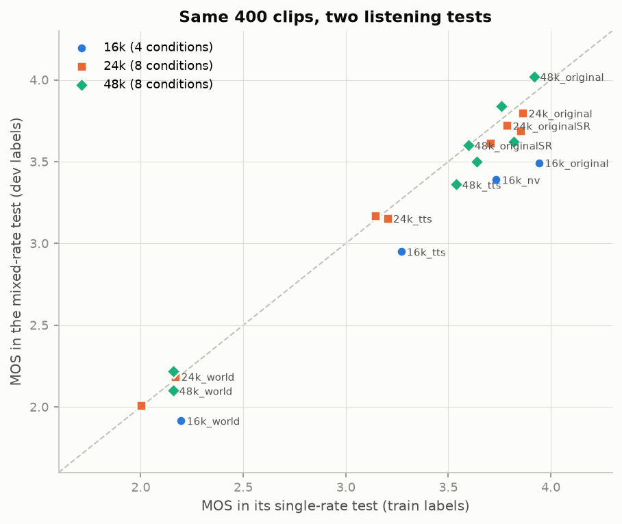
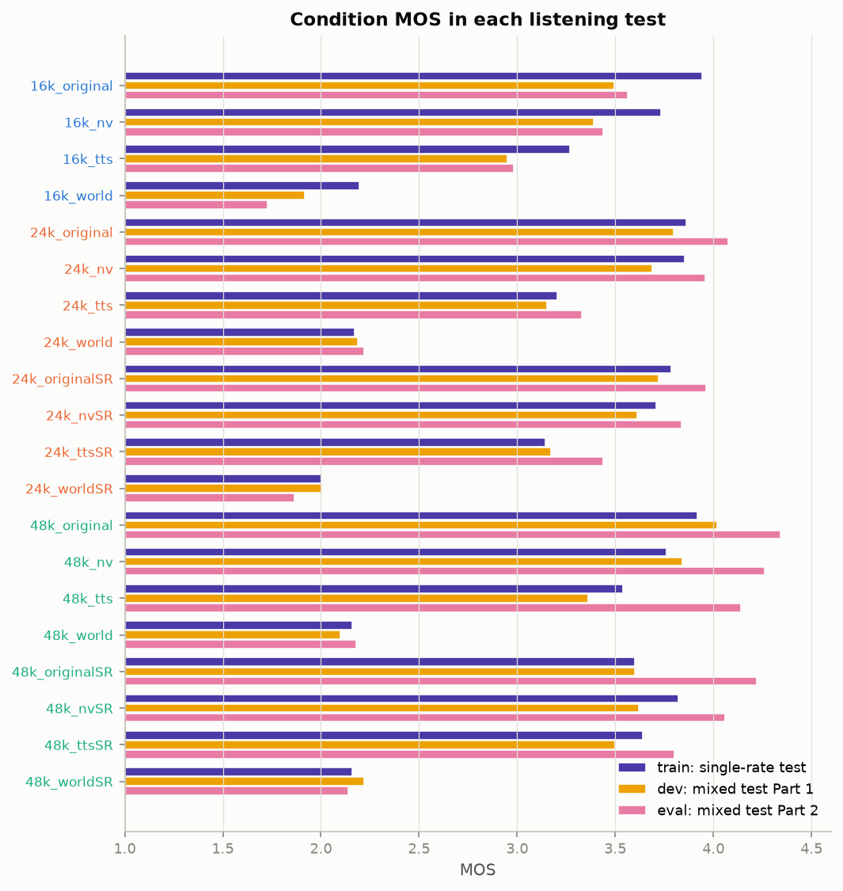
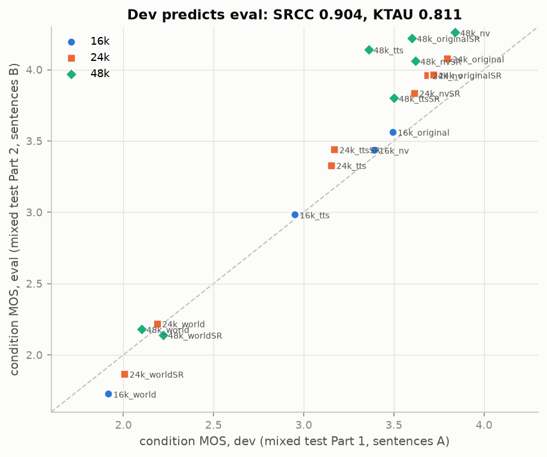
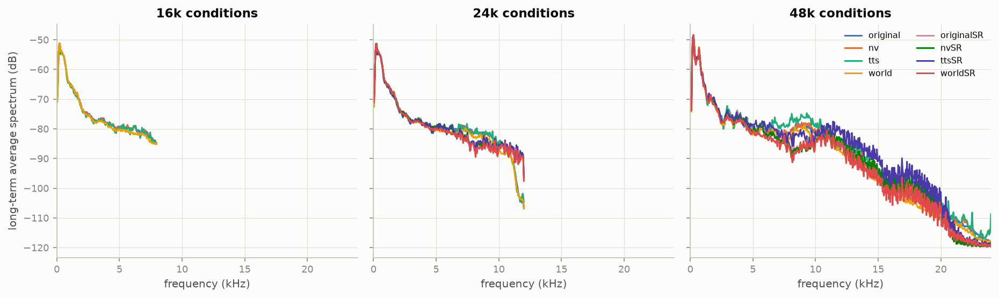
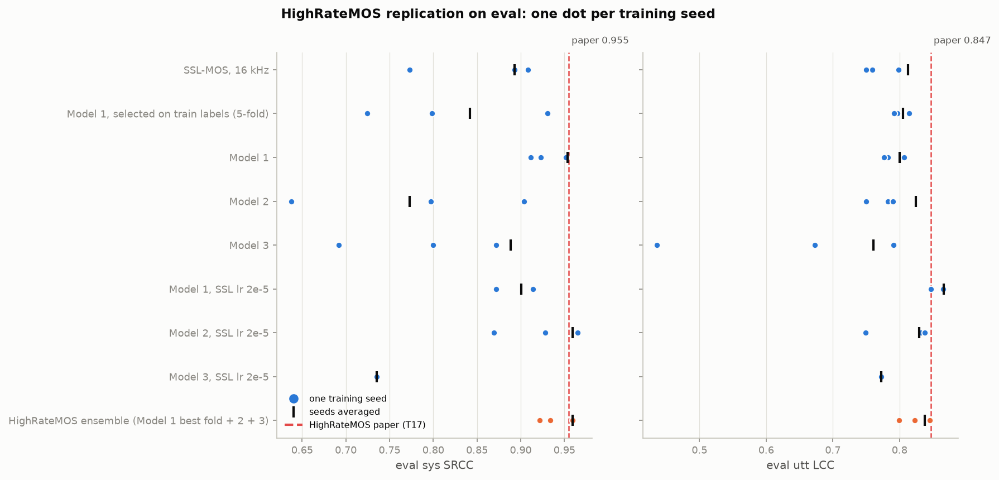
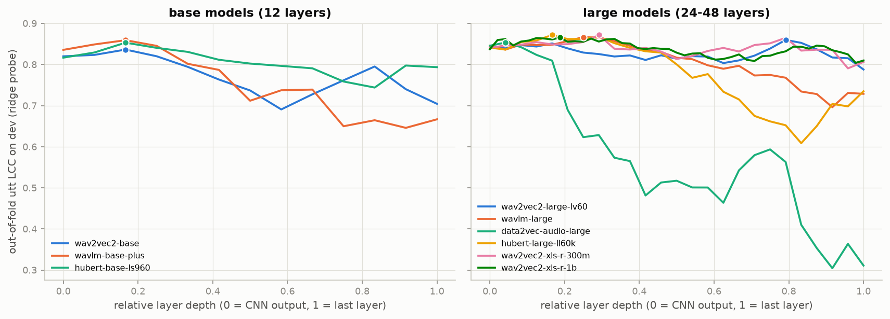

# SOTA-MOS

MOS prediction for speech at 16, 24 and 48 kHz: [AudioMOS Challenge 2025](https://sites.google.com/view/voicemos-challenge/past-challenges/audiomos-challenge-2025) Track 3.

The goal is to replicate [HighRateMOS](https://arxiv.org/abs/2506.21951), the Track 3 winner (team T17), and beat it.
We also compare against the challenge baseline SSL-MOS (B03) and [faster-UTMOSv2](https://github.com/Scicom-AI-Enterprise-Organization/faster-UTMOSv2).

**Data:** [Scicom-intl/HighRateMOS-VoiceMOS2025](https://huggingface.co/Scicom-intl/HighRateMOS-VoiceMOS2025), a mirror of the challenge archives (model-type repo).

## The task

There are 20 conditions. Each is one generation method at one sampling rate: 4 at 16 kHz, 8 at 24 kHz, 8 at 48 kHz.
The methods are natural speech, WORLD vocoder, a neural vocoder and TTS, plus an AudioSR super-resolved version of each (`*SR`).
Each clip has 10 ratings on a 1–5 scale.

| split | clips | sentences | listening test | listeners |
|---|---|---|---|---|
| train | 400 (120 at 16k, 240 at 24k, 40 at 48k) | 30 | three single-rate tests, one per sampling rate | 01–10 |
| dev | the same 400 clips | 30 | one mixed-rate test | 01–10 |
| eval | 400 new clips | 30 others | the mixed-rate test, second half | 11–20 |

Train labels come from tests where every clip had the same sampling rate. Dev and eval labels come from a test that mixed all three rates.
The primary metric is **system-level SRCC** over the 20 conditions.

## Target

Official Track 3 evaluation results (HighRateMOS paper, Table I).

| system | utt MSE | utt LCC | utt SRCC | utt KTAU | sys MSE | sys LCC | sys SRCC | sys KTAU |
|---|---:|---:|---:|---:|---:|---:|---:|---:|
| B03 baseline | 0.273 | 0.821 | 0.695 | 0.508 | 0.119 | 0.941 | 0.749 | 0.547 |
| T08 | 0.277 | 0.811 | 0.716 | 0.529 | **0.056** | 0.978 | 0.913 | 0.758 |
| T11 | 0.282 | 0.813 | 0.714 | 0.536 | 0.085 | 0.968 | 0.917 | 0.789 |
| T13 | 0.298 | 0.796 | 0.671 | 0.487 | 0.090 | 0.972 | 0.926 | 0.779 |
| T16 | 0.287 | 0.830 | 0.723 | **0.589** | 0.071 | 0.952 | 0.891 | 0.750 |
| T19 | **0.238** | 0.846 | 0.694 | 0.513 | 0.080 | 0.955 | 0.914 | 0.758 |
| **T17 HighRateMOS** | 0.303 | **0.847** | **0.742** | 0.556 | 0.116 | **0.982** | **0.955** | **0.842** |

## The data

`scripts/analyze_data.py` produces every number and figure in this section.

### The mixed test punishes 16 kHz



**All four 16 kHz conditions fall below the diagonal.** On average they drop 0.35 MOS once listeners also hear 24 and 48 kHz audio.
The 24 kHz conditions move by −0.05 and the 48 kHz ones by −0.04. The same ten listeners rated both tests.

The train labels still rank the dev conditions at sys-SRCC 0.874. A model that perfectly reproduced the train labels would be capped there on dev.

### Eval listeners favour high rates even more



Eval has new sentences and a new panel of listeners. Compared with dev, the 16 kHz conditions are unchanged, 24 kHz gains 0.17 and 48 kHz gains 0.36.
48k_tts moves from 3.36 to 4.14. Each 48 kHz condition averages only 5 clips.

### Knowing each clip's condition gets sys-SRCC 0.904



These reference predictors are given each eval clip's condition and output that condition's MOS from another test:

| reference predictor on eval | utt MSE | utt LCC | utt SRCC | utt KTAU | sys MSE | sys LCC | sys SRCC | sys KTAU |
|---|---:|---:|---:|---:|---:|---:|---:|---:|
| dev condition MOS | 0.201 | 0.894 | 0.819 | 0.666 | 0.100 | 0.980 | 0.904 | 0.811 |
| train condition MOS | 0.222 | 0.856 | 0.702 | 0.520 | 0.101 | 0.945 | 0.748 | 0.575 |

**Condition identity alone beats every Track 3 team on all four utterance-level metrics.**
The train-label reference scores sys-SRCC 0.748, the same as the B03 baseline (0.749).

HighRateMOS reaches sys-SRCC 0.955, above the dev reference. For comparison, two random halves of the eval listeners agree with each other at sys-SRCC 0.95.
Gaps of ±0.02 in sys-SRCC are within listener noise. The utterance-level reliability of eval labels is 0.90 (split-half, Spearman-Brown corrected).

### The sampling rate sets the bandwidth



Every clip fills the band up to its Nyquist frequency. At 24 kHz, the AudioSR versions reach 12 kHz while the plain versions roll off at about 11.5 kHz.
A model that resamples everything to 16 kHz sees the same 0–8 kHz band for 16k_original, 24k_original and 48k_original. Eval rates those three at 3.56, 4.08 and 4.34.

## Rules

- **The model sees audio and the sampling rate only.** The sampling rate comes from the file header.
  Eval filenames name the condition (`16k_sys1_utt31`). They are used only to group clips for system-level metrics.
- **Eval labels are never used for selection.** Checkpoints, configs and ensemble members are chosen on dev labels, or on out-of-fold predictions from 5-fold CV grouped by sentence.
- **Two label settings.** *train-only* uses the train labels, as in the HighRateMOS paper.
  *train+dev* adds the dev labels, which the challenge released at the start of its evaluation phase. Every result states which one it uses.
- **The final system is picked by a fixed rule, written down before any of our systems was scored on eval.**
  Greedy forward selection with replacement (Caruana et al., 2004, at most 10 members) runs over every train+dev candidate:
  fine-tuned CV systems and frozen-feature probes. The score is the mean of utt LCC, utt SRCC, sys LCC and sys SRCC,
  computed on out-of-fold predictions for the 400 dev clips. The chosen ensemble is scored on eval once.
- **One disclosed exception.** The server's equivalence check printed eval metrics for a 4-member test ensemble (sys SRCC 0.973).
  The members were picked to cover every serving code path. That ensemble plays no part in selection, and the check now prints eval metrics only with `--eval`.

## Systems

| name | what it is | input rates |
|---|---|---|
| SSL-MOS | wav2vec2-base, SHEET recipe (B03-style baseline) | everything resampled to 16 kHz |
| HighRateMOS Models 1–3 | wav2vec2-base fed native-rate samples, sampling-rate embedding, multi-scale CNN on the mel spectrogram, BLSTM, FC. Model 2 adds cross-attention and Model 3 adds MFCC | native 16 / 24 / 48 kHz |
| HighRateMOS ensemble | Model 1 (best of 5 folds) + Models 2 and 3, as in paper Section V-D | native |
| faster-UTMOSv2 | the pretrained VMC 2024 winner, off the shelf (zero-shot), for comparison | resampled to 16 kHz |
| ours | SSL on the waveform + multi-scale CNN on the native-rate mel spectrogram (common 0–24 kHz axis) + sampling-rate and listening-test embeddings, trained on train+dev labels | native 16 / 24 / 48 kHz |

Our model reads every clip at its own sampling rate. The mel branch places all rates on one 0–24 kHz axis, so a 48 kHz clip contributes its 8–24 kHz band and a 16 kHz clip shows its 8 kHz ceiling.

### What we implemented for HighRateMOS

The paper fixes the building blocks and the optimiser. We filled in the rest as follows.

| part | paper | ours |
|---|---|---|
| SSL | wav2vec2 Base, native-rate samples fed as if 16 kHz | `facebook/wav2vec2-base`, last layer, fine-tuned end to end |
| sampling-rate embedding | learnable vector | 32 dims, repeated over frames |
| mel branch | multi-scale CNN | 80 mel bands over 0–24 kHz (25 ms window, 10 ms hop) at the native rate. Three conv stacks (3×3, 5×5, 7×7), two layers of 32 channels each, pooled to 8 frequency bands, then 128 dims, resampled to the SSL frame rate |
| MFCC (Model 3) | MFCC | 40 coefficients from the same mel, projected to 64 dims |
| cross-attention (Models 2, 3) | SSL attends to spectral features | SSL frames query the mel/MFCC frames: 256 dims, 4 heads |
| aggregation | BLSTM + FC | BLSTM 128 per direction, per-frame FC head (64 hidden, tanh range clip), mean over frames |
| loss | MAE, rank-based, correlation (challenge summary) | MAE + UTMOS contrastive (margin 0.1) + (1 − LCC), equal weights |
| optimiser | AdamW, lr 1e-3, batch 8 | same, gradient clipping at 1.0 |
| stopping | dev sys-SRCC stops rising for 2000 steps | evaluate every 100 steps, patience 20, keep the best |
| ensemble | Model 1 best of 5 folds + Models 2, 3 | best of 5 = highest dev sys-SRCC over all 400 dev clips |

## Experiments

Every run writes its dev (or out-of-fold) and eval predictions. Selection only reads the dev side.

| group | system | runs | protocol | labels | status |
|---|---|---:|---|---|---|
| replication | SSL-MOS 16 kHz | 3 seeds | dev selection | train | running |
| replication | HighRateMOS Model 1 | 3 seeds | dev selection | train | running |
| replication | HighRateMOS Model 2 | 3 seeds | dev selection | train | running |
| replication | HighRateMOS Model 3 | 3 seeds | dev selection | train | running |
| replication | HighRateMOS Model 1, 5-fold (training phase) | 3 seeds × 5 folds | CV on train labels | train | running |
| replication | Models 1–3 with SSL lr 2e-5 | 3 × 3 seeds | dev selection | train | queued |
| comparison | faster-UTMOSv2, pretrained, zero-shot | 5 folds | none | none | running |
| ours | 17 variants: base; labels mix-only / train-only; native-rate SSL input; no mel; no SR embedding; pooled head; weighted layers; BLSTM; condition-balanced sampling; HighRateMOS loss; 6 other backbones | 17 × 5 folds | 5-fold CV by sentence | train+dev | queued |
| probes | ridge on frozen SSL layers: 9 backbones × 2 input modes (16 kHz, native) | 18 feature sets | 5-fold CV by sentence | train+dev | features extracted |

**126 training runs** in total: 36 replication, 5 UTMOSv2, 85 ours. Plus 18 frozen-feature probes.

## Results

### Replication: HighRateMOS reproduces, with a wide seed spread



**Our HighRateMOS ensemble scores eval sys SRCC 0.959 and KTAU 0.842. The paper reports 0.955 and 0.842.**
That is three training seeds averaged. One seed of the 3-model ensemble, as in the paper, gives 0.959, 0.922 and 0.934.

All rows train on train labels only and select checkpoints on dev labels, as the paper does.

| eval | utt MSE | utt LCC | utt SRCC | utt KTAU | sys MSE | sys LCC | sys SRCC | sys KTAU | sys SRCC per seed |
|---|---:|---:|---:|---:|---:|---:|---:|---:|---|
| HighRateMOS, paper (T17) | 0.303 | 0.847 | 0.742 | 0.556 | 0.116 | 0.982 | 0.955 | 0.842 | – |
| HighRateMOS ensemble, ours, seed 0 | 0.259 | 0.846 | 0.712 | 0.515 | 0.150 | 0.958 | 0.959 | 0.853 | – |
| HighRateMOS ensemble, ours, 3 seeds | 0.264 | 0.838 | 0.686 | 0.492 | 0.130 | 0.960 | 0.959 | 0.842 | 0.959 / 0.922 / 0.934 |
| Model 1 | 0.294 | 0.800 | 0.666 | 0.478 | 0.073 | 0.976 | 0.953 | 0.842 | 0.923 / 0.952 / 0.911 |
| Model 2 | 0.267 | 0.825 | 0.634 | 0.449 | 0.136 | 0.935 | 0.773 | 0.611 | 0.638 / 0.904 / 0.797 |
| Model 3 | 0.387 | 0.761 | 0.582 | 0.392 | 0.216 | 0.948 | 0.889 | 0.695 | 0.800 / 0.872 / 0.692 |
| Model 1, selected on train labels | 0.286 | 0.805 | 0.669 | 0.474 | 0.095 | 0.959 | 0.842 | 0.663 | 0.931 / 0.725 / 0.798 |
| SSL-MOS, 16 kHz | 0.283 | 0.812 | 0.670 | 0.478 | 0.067 | 0.964 | 0.893 | 0.758 | 0.773 / 0.908 / 0.893 |
| faster-UTMOSv2, off the shelf | 0.328 | 0.785 | 0.753 | 0.576 | 0.153 | 0.952 | 0.893 | 0.758 | 5 pretrained folds |

- **Single models are unstable.** Model 2 seed 0 scores sys SRCC 0.638 on eval after 0.946 on dev.
  Model 3 seed 2 drops to utt LCC 0.436. Averaging models is what makes the paper's number reachable.
- **Dev-label selection carries the system ranking.** Model 1 selected on held-out train labels, as in the challenge's training phase, gets sys SRCC 0.842.
  Selected on dev labels, it gets 0.953. The train labels hold no preference for high rates. The checkpoint chosen on dev labels picks one up.
- **The utterance level is where the paper is weakest.** Its utt SRCC of 0.742 sits below the dev-condition reference (0.819). Our replication's 0.686 sits lower still.
- **faster-UTMOSv2 off the shelf matches SSL-MOS on sys SRCC (0.893) and beats HighRateMOS on utt SRCC (0.753).** It sees only 16 kHz audio and has never seen Track 3.

### Frozen SSL features: the quality signal sits in early layers



Ridge regression on the mean and std of one frozen layer, plus one-hots for sampling rate and listening test, trained on train+dev labels.
The scores are out-of-fold on the dev labels, using the same 5 sentence folds as fine-tuning.

**Every backbone peaks at 15–30% of its depth.** The last layers of data2vec, HuBERT-large and WavLM-large lose up to half of the signal.

| probe (best layer) | utt LCC | utt SRCC | utt MSE | sys SRCC | sys KTAU |
|---|---:|---:|---:|---:|---:|
| XLS-R 300M, layer 7 | **0.872** | 0.827 | 0.149 | 0.917 | 0.789 |
| HuBERT-large, layer 4 | **0.872** | 0.827 | **0.148** | 0.947 | 0.842 |
| WavLM-large, layer 6 | 0.867 | 0.819 | 0.154 | 0.940 | 0.832 |
| XLS-R 1B, layer 9 | 0.866 | 0.822 | 0.155 | 0.938 | 0.821 |
| wav2vec2-large, layer 19 | 0.860 | 0.816 | 0.163 | 0.937 | 0.821 |
| data2vec-large, layer 1 | 0.853 | 0.809 | 0.171 | **0.974** | **0.884** |
| wav2vec2-base, layer 2 | 0.836 | 0.774 | 0.189 | 0.908 | 0.789 |
| MFCC statistics | 0.623 | 0.644 | 0.417 | 0.976 | 0.916 |

MFCC statistics rank the dev conditions well (sys SRCC 0.976) while ranking clips poorly (utt LCC 0.62). The same probe trained on train labels alone still reaches sys SRCC 0.970.
That is above the 0.874 ceiling for a model that reproduces the train labels exactly. The system-level ranking is sensitive to per-rate offsets that a model can hit by accident.

## Setup

Training runs on a remote machine. [claude-ping](https://github.com/Scicom-AI-Enterprise-Organization/claude-ping) keeps one persistent SSH connection open, and `uv` manages the environment.

```bash
CP=../claude-ping/claude-ping
$CP up
$CP sync
$CP env-sync                                              # HF_TOKEN from .env
$CP exec 'cd /root/SOTA-MOS && uv sync'
$CP exec 'cd /root/SOTA-MOS && uv run python scripts/prepare_data.py'
$CP exec 'cd /root/SOTA-MOS && uv run python scripts/analyze_data.py'
```

Train one model, or run a whole job file across the GPUs:

```bash
uv run python -m sotamos.train --config configs/hrm_model1.yaml --seed 0 --out exp/rep/hrm_model1/s0
uv run python scripts/make_jobs.py phase1
uv run python scripts/run_queue.py jobs/phase1.txt --gpus 0,1,2,3,4,5,6,7 --per-gpu 3
uv run python scripts/report.py rep
```

## Layout

```
sotamos/     data, features, models, losses, metrics, training, reporting
scripts/     data preparation, analysis, probes, job files, queue, ensembling, plots
configs/     experiment configs
results/     metric tables, predictions and figures
```
