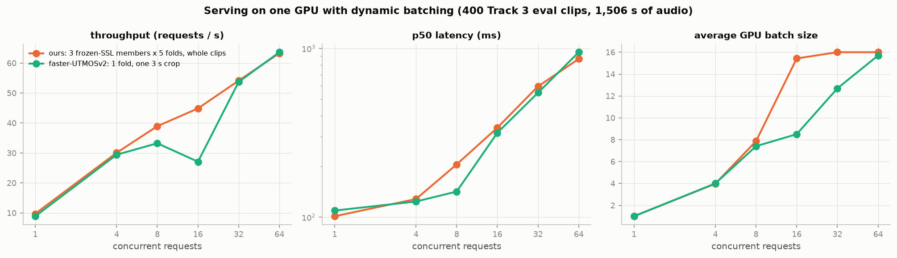
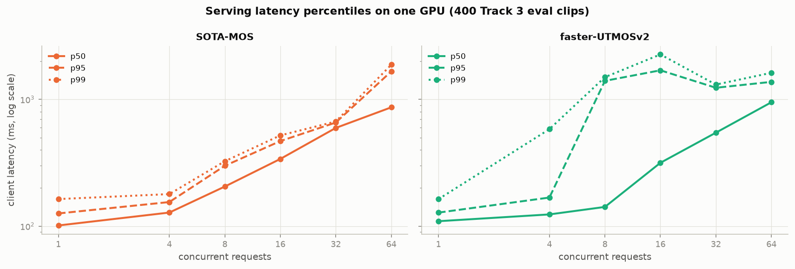

# SOTA-MOS serving

A FastAPI server with dynamic batching for the final SOTA-MOS ensemble. The design follows
[faster-UTMOSv2/serving](https://github.com/Scicom-AI-Enterprise-Organization/faster-UTMOSv2/tree/main/serving).

```
bytes ─► [process pool]   decode; any rate ─► nearest trained rate (16/24/48 kHz) + a 16 kHz copy
      ─► [asyncio queue]  dynamic batching: MAX_BATCH clips, MAX_WAIT_MS, padded-size budget
      ─► [GPU thread]     Engine.score(batch): each SSL backbone once per batch, masked padding,
                          probe heads + fine-tuned folds ─► weighted MOS
      ─► JSON {"mos", "input_sampling_rate", "sampling_rate", "duration_s", "batch_size", "gpu_ms", "total_ms"}
```

## Why this shape

**Clips arrive at any rate and any length.** 16, 24 and 48 kHz pass through untouched. Any other rate is resampled to the nearest trained rate:

| input rate | served as |
|---:|---:|
| 8 / 11.025 kHz | 16 kHz (up) |
| 22.05 kHz | 24 kHz (up) |
| 28 / 32 kHz | 24 kHz (down) |
| 44.1 kHz | 48 kHz (up) |
| 88.2 / 96 kHz | 48 kHz (down) |

That rate feeds the native-rate members and the rate input. A 16 kHz copy, made from the original signal, feeds the 16 kHz members.

**Variable lengths need length-aware batching.** UTMOSv2 crops every clip to a fixed 3 s window. We score the whole clip.
Each batch starts from the oldest waiting clip, so long clips never starve. It then adds the waiting clips closest to that length, while the padded size (clips × longest clip) stays under `MAX_BATCH_SECONDS`.

**Padding must not change the score.** Large SSL models have a layer-norm conv front end, so they take padded batches with an attention mask, and pooling covers valid frames only.
Base models normalise over time in their first conv layer, so padding would shift their statistics. Those clips run one by one.

**Each backbone runs once per batch**, truncated one block above the deepest layer any member reads. All members that share it reuse its hidden states.

**The server is a drop-in replacement for faster-UTMOSv2's server.** Same routes, same `file` field, same `?reps=` and `?dataset=` parameters
(accepted; SOTA-MOS is deterministic and has no data-domain), same response keys in the same order and types, same status codes.
It adds three keys after them: `input_sampling_rate`, `sampling_rate` (the trained rate the clip was scored at) and `duration_s`.

```
SOTA-MOS:       {"mos": 3.7948, "reps": 1, "gpu_ms": 141.17, "total_ms": 161.6, "batch_size": 1, "input_sampling_rate": 44100, "sampling_rate": 48000, "duration_s": 5.599}
faster-UTMOSv2: {"mos": 3.21875, "reps": 1, "gpu_ms": 130.26, "total_ms": 150.69, "batch_size": 1}
```

`check_api_compat.py` runs both servers side by side and checks every route: `POST /predict` (with and without `reps`/`dataset`),
invalid `reps` (422), a missing file (422), non-audio bytes (500), `/health`, `/stats`, `/warmup` and `/`. All pass.
faster-UTMOSv2's own `benchmark.py` runs against the SOTA-MOS server unchanged.

## Endpoints

| Method | Path | Notes |
|---|---|---|
| POST | `/predict` | multipart `file` (wav, flac, ...); `?reps=N` (1–16) and `?dataset=` accepted. Returns `{"mos", "reps", "gpu_ms", "total_ms", "batch_size", "input_sampling_rate", "sampling_rate", "duration_s"}`. `sampling_rate` is the trained rate the clip was scored at |
| GET | `/` | upload form |
| GET | `/health` | system members, device, batching knobs |
| GET | `/stats` | batches, average batch size, padding overhead |
| POST | `/warmup` | re-prime the GPU |

## Run

```bash
uv sync --extra serve
cd serving
SYSTEM=../results/final/both/system.json MAX_BATCH=16 PP_WORKERS=16 bash run_serve.sh
curl -X POST http://127.0.0.1:8000/predict -F file=@clip_48k.wav
```

| Var | Default | Meaning |
|---|---|---|
| `SYSTEM` | `../results/final/both/system.json` | exported ensemble (`scripts/export_final.py`) |
| `MAX_BATCH` | 16 | max clips per GPU batch |
| `MAX_WAIT_MS` | 10 | how long the oldest waiting clip waits for a batch to fill |
| `MAX_BATCH_SECONDS` | 240 | padded 16 kHz audio per batch (clips × longest clip) |
| `PP_WORKERS` | 8 | decode/resample processes |
| `DTYPE` | bf16 | autocast for the SSL forward |

## Checks

`check_equivalence.py` scores the 400 eval clips through the engine at batch sizes 1, 8 and 32. It compares them with the offline predictions of the same system.
`benchmark.py` measures req/s, RTF and latency at several concurrency levels. `check_api_compat.py` checks the API against faster-UTMOSv2's server.

## Benchmark

One GPU, the 400 Track 3 eval clips (1,506 s of audio), both servers run back to back with the same client:

| concurrency | SOTA-MOS req/s | RTF | p50 ms | p95 ms | faster-UTMOSv2 req/s | RTF | p50 ms | p95 ms |
|---:|---:|---:|---:|---:|---:|---:|---:|---:|
| 1 | 9.7 | 37× | 101 | 126 | 8.9 | 33× | 109 | 128 |
| 4 | 30.1 | 113× | 128 | 155 | 29.4 | 111× | 124 | 168 |
| 8 | 38.9 | 147× | 205 | 299 | 33.2 | 125× | 142 | 1400 |
| 16 | 44.9 | 169× | 339 | 469 | 27.1 | 102× | 316 | 1696 |
| 32 | 54.1 | 204× | 596 | 657 | 53.7 | 202× | 546 | 1235 |
| 64 | 63.3 | 238× | 866 | 1663 | 63.6 | 240× | 949 | 1375 |




